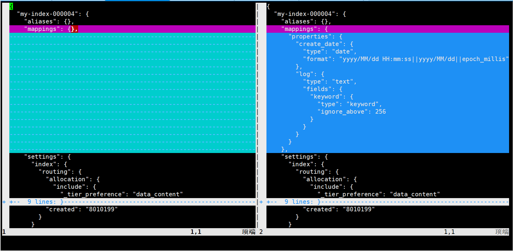
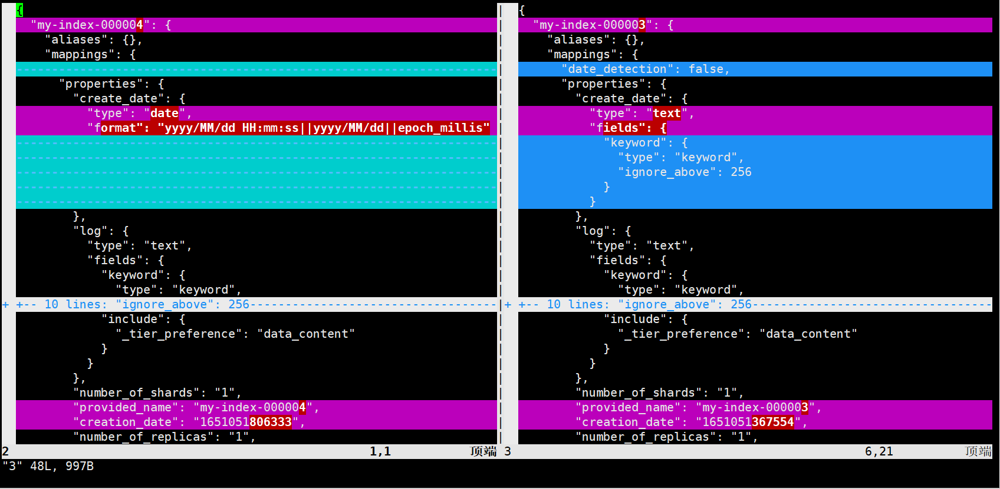

#  Dynamic mapping and some setting

## default setting

curl -XPUT --cacert http_ca.crt -u elastic:*PQpBaR*8J65xQCgTMxq https://localhost:9200/my-index-000004

curl --cacert http_ca.crt -u elastic:*PQpBaR*8J65xQCgTMxq https://localhost:9200/my-index-000004

```
{
  "my-index-000004": {
    "aliases": {},
    "mappings": {},
    "settings": {
      "index": {
        "routing": {
          "allocation": {
            "include": {
              "_tier_preference": "data_content"
            }
          }
        },
        "number_of_shards": "1",
        "provided_name": "my-index-000004",
        "creation_date": "1651051806333",
        "number_of_replicas": "1",
        "uuid": "eU_RESIKSlK_Kk7w7-_wIQ",
        "version": {
          "created": "8010199"
        }
      }
    }
  }
}
```

curl -XPUT --cacert http_ca.crt -u elastic:*PQpBaR*8J65xQCgTMxq https://localhost:9200/my-index-000004/_doc/1 -H 'Content-Type:application/json' -d '@test.json'

```test.json
{
  "create_date": "2015/09/02",
  "log": "Hello World"
}
```

curl --cacert http_ca.crt -u elastic:*PQpBaR*8J65xQCgTMxq https://localhost:9200/my-index-000004

```
{
  "my-index-000004": {
    "aliases": {},
    "mappings": {
      "properties": {
        "create_date": {
          "type": "date",
          "format": "yyyy/MM/dd HH:mm:ss||yyyy/MM/dd||epoch_millis"
        },
        "log": {
          "type": "text",
          "fields": {
            "keyword": {
              "type": "keyword",
              "ignore_above": 256
            }
          }
        }
      }
    },
    "settings": {
      "index": {
        "routing": {
          "allocation": {
            "include": {
              "_tier_preference": "data_content"
            }
          }
        },
        "number_of_shards": "1",
        "provided_name": "my-index-000004",
        "creation_date": "1651051806333",
        "number_of_replicas": "1",
        "uuid": "eU_RESIKSlK_Kk7w7-_wIQ",
        "version": {
          "created": "8010199"
        }
      }
    }
  }
}
```



## 更改date_detection属性

curl -XPUT --cacert http_ca.crt -u elastic:*PQpBaR*8J65xQCgTMxq https://localhost:9200/my-index-000003

curl --cacert http_ca.crt -u elastic:*PQpBaR*8J65xQCgTMxq https://localhost:9200/my-index-000003

curl -XPUT --cacert http_ca.crt -u elastic:*PQpBaR*8J65xQCgTMxq https://localhost:9200/my-index-000003/_mapping -H 'Content-Type:application/json' -d '@s'

```s
{
    "date_detection": false
}
```

curl --cacert http_ca.crt -u elastic:*PQpBaR*8J65xQCgTMxq https://localhost:9200/my-index-000003

curl -XPUT --cacert http_ca.crt -u elastic:*PQpBaR*8J65xQCgTMxq https://localhost:9200/my-index-000003/_doc/1 -H 'Content-Type:application/json' -d '@test.json'

```test.json
{
  "create_date": "2015/09/02",
  "log": "Hello World"
}
```

curl --cacert http_ca.crt -u elastic:*PQpBaR*8J65xQCgTMxq https://localhost:9200/my-index-000003

```
{
  "my-index-000003": {
    "aliases": {},
    "mappings": {
      "date_detection": false,
      "properties": {
        "create_date": {
          "type": "text",
          "fields": {
            "keyword": {
              "type": "keyword",
              "ignore_above": 256
            }
          }
        },
        "log": {
          "type": "text",
          "fields": {
            "keyword": {
              "type": "keyword",
              "ignore_above": 256
            }
          }
        }
      }
    },
    "settings": {
      "index": {
        "routing": {
          "allocation": {
            "include": {
              "_tier_preference": "data_content"
            }
          }
        },
        "number_of_shards": "1",
        "provided_name": "my-index-000003",
        "creation_date": "1651051367554",
        "number_of_replicas": "1",
        "uuid": "JWpw2eoQTU2V7B6THhEe_g",
        "version": {
          "created": "8010199"
        }
      }
    }
  }
}
```


